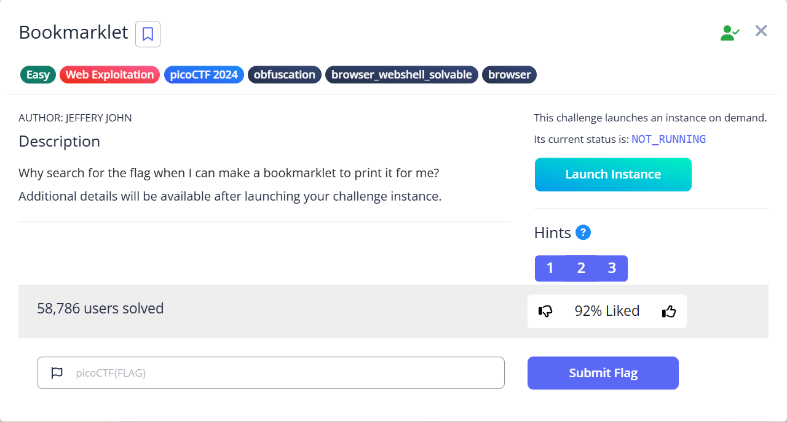
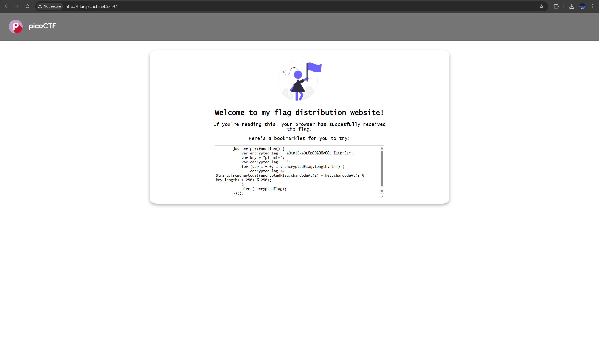
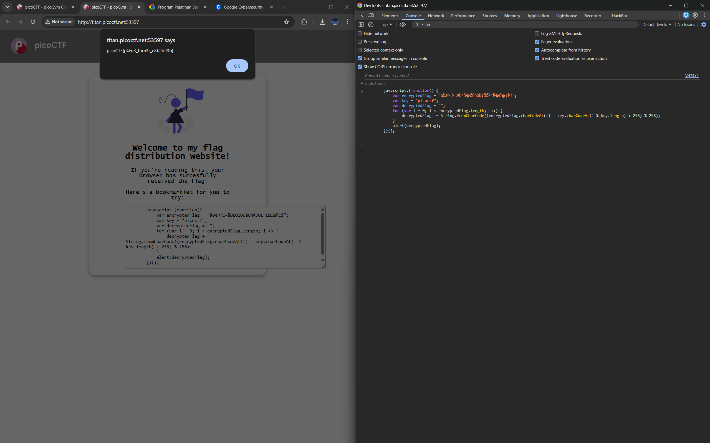

# Bookmarklet

Hints:
> A bookmarklet is a bookmark that runs JavaScript instead of loading a webpage.

> What happens when you click a bookmarklet?

> Web browsers have other ways to run JavaScript too.

Hmm kita diminta untuk running JS di web browser yaitu di terminal browser...

Pada box sudah menyediakan kode JS nya dan didalamnya sudah terdapat flag namun masih terenkripsi, kode tersebut merupakan decryptor untuk flag terenkrip tinggal kita coba running saja di terminal web browser...

Ez peazy banana squizy...

> Flag: `picoCTF{p@g3_turn3r_e8b2d43b}`