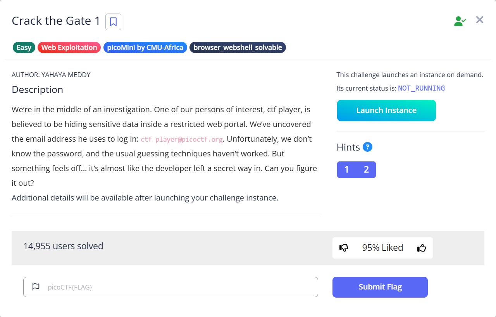
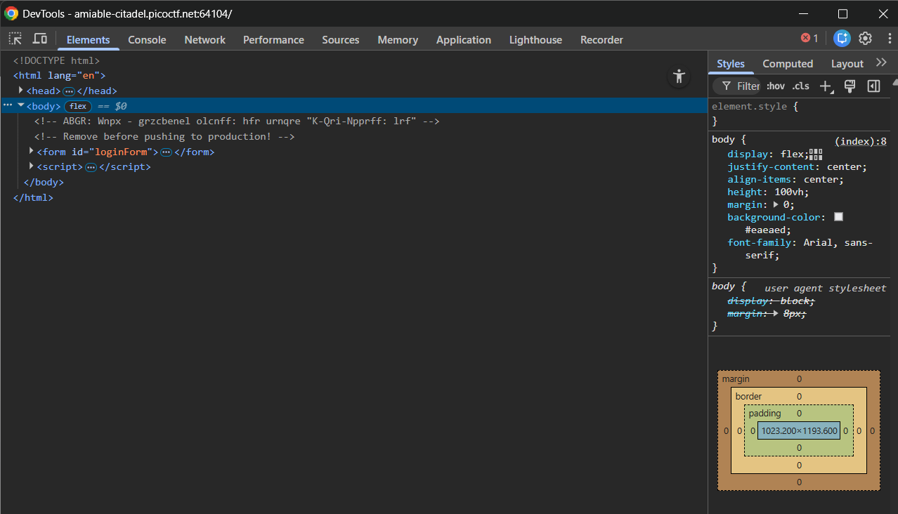
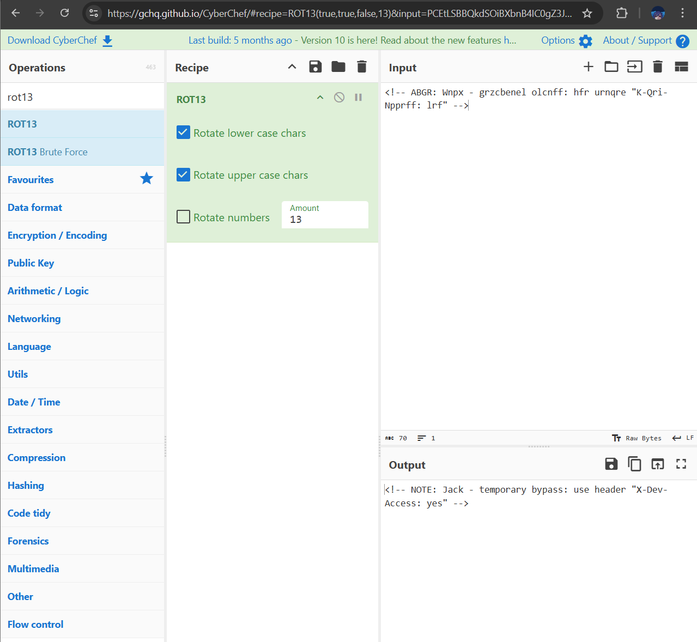
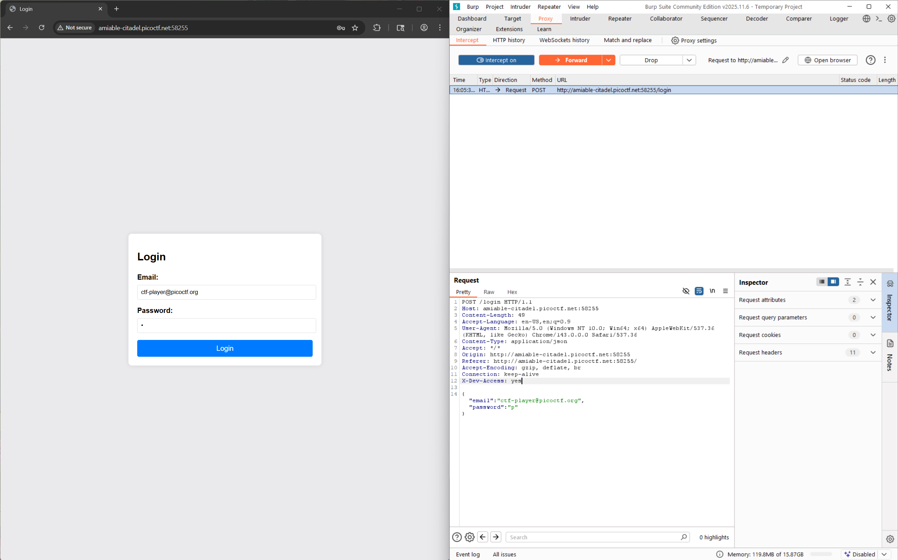
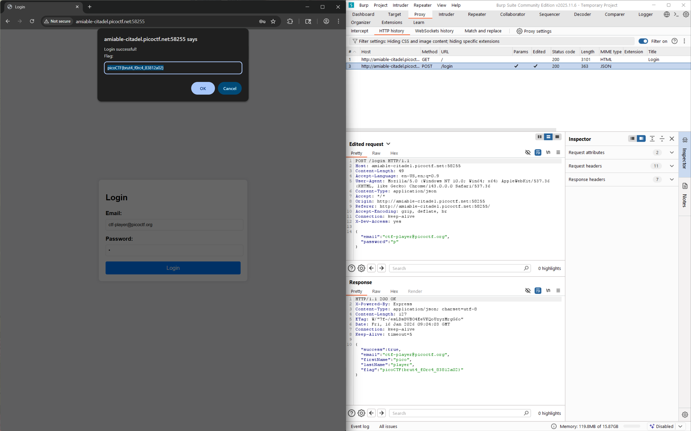

# Crack the Gate 1

Hints:
> Developers sometimes leave notes in the code; but not always in plain text.

> A common trick is to rotate each letter by 13 positions in the alphabet.

Kita diberikan sebuah kredensial berupa email yang digunakan untuk melakukan log in namun kita tidak diberikan password (hmm mungkin ada cara tersendiri, omoshiroi...). Disisi lain kita juga mendapatkan petunjuk yang mengatakan `terkadang devloper meninggalkan catatan di kode dan catatan tersebut tidak selalu dalam bentuk plaintext`. Untuk kasus ini catatan tersebut di encode dengan teknik enkripsi `ROT13`. 

Setelah kita menjalankan instance kita dapat melihat pada source code web nya terdapat note kode yang anomali sesuai yang diberikan hint diawal.

Copy note anomali tersebut bawa ke <a href="https://gchq.github.io/CyberChef/">CyberChef</a>

Resep yang kita perlukan hanyalah ROT13, setelah decode kita mendapatkan petunjuk tambahan yang mengatakan bahwa terdapat cara untuk melakukan bypass (mungkin yang dimaksud adalah bypass log in, hmm...) dengan menggunakan header `X-Dev-Access: yes`. 

Kita coba buka burpsuite dan ubah header requestnya.

Kita isi passwordnya asal asal dan jangan lupa sebelum menekan login di nyalakan interceptnya dahulu. Kita ubah request headernya dengan menambahkan `X-Dev-Access: yes` sebelum data login.

Woilah dapet....

> Flag: `picoCTF{brut4_f0rc4_83812a02}`
