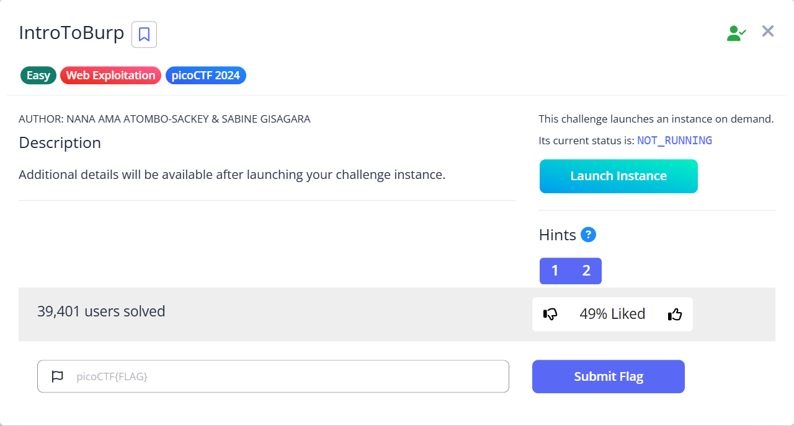
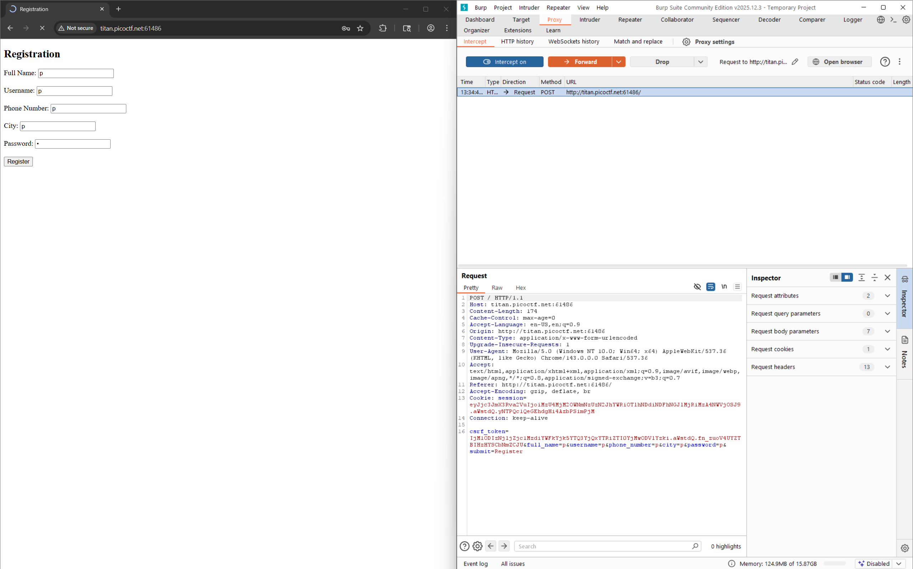
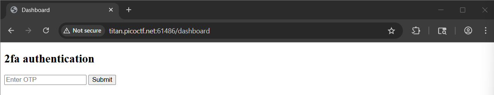
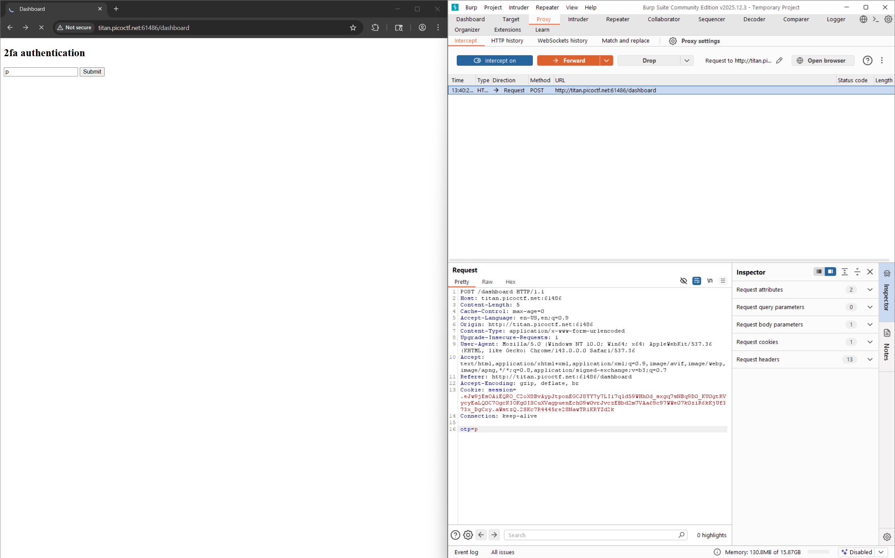
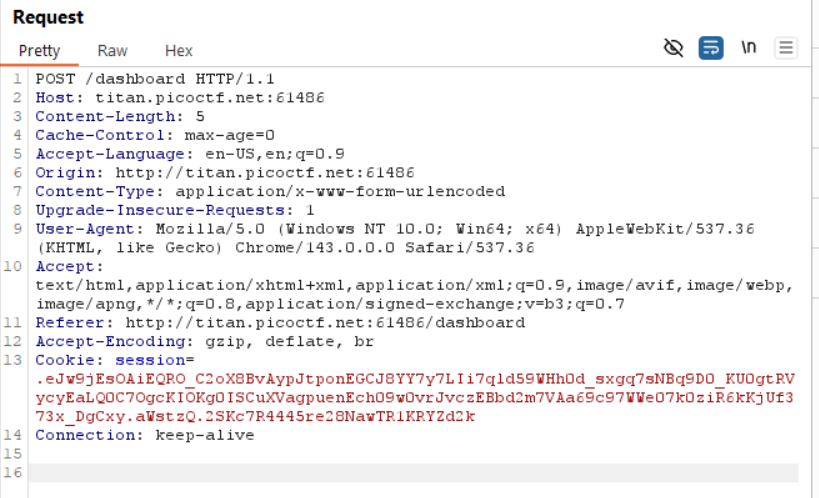
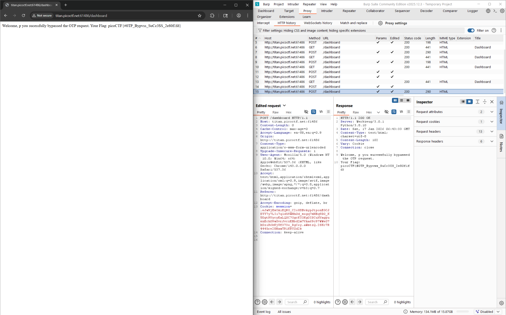

# IntroToBurp

Hints:
> Try using burpsuite to intercept request to capture the flag.

> Try mangling the request, maybe their server-side code doesn't handle malformed requests very well.

Kita diminta pakai BurpSuite lek...

Karena kita tidak ada petunjuk, kita coba register dengan kredensial asal asal...

Setelah itu kita diminta mengisi 2FA Authentication dan disini kita dapat memanipulasi request 2FA tersebut.

Di kolom tersebut kita isi OTP asal asal dan ketika kita submit, kita melihat request tersebut terdata di dalamnya...

Tinggal kita hapus saja bagian tersebut, namun jangan hapus barisnya...

Yatta ketemu...

> Flag: `picoCTF{#0TP_Bypvss_SuCc3$S_2e80f1fd}`