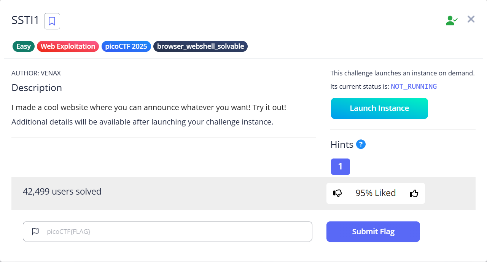
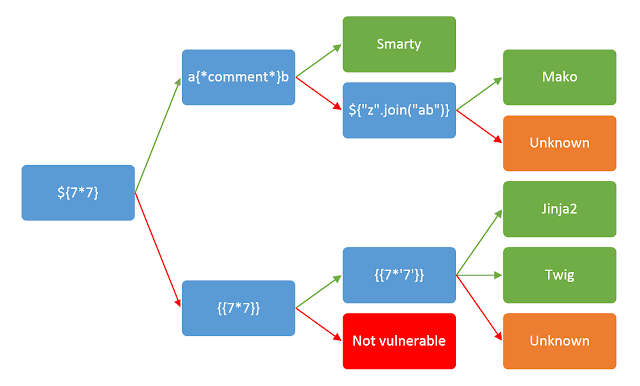
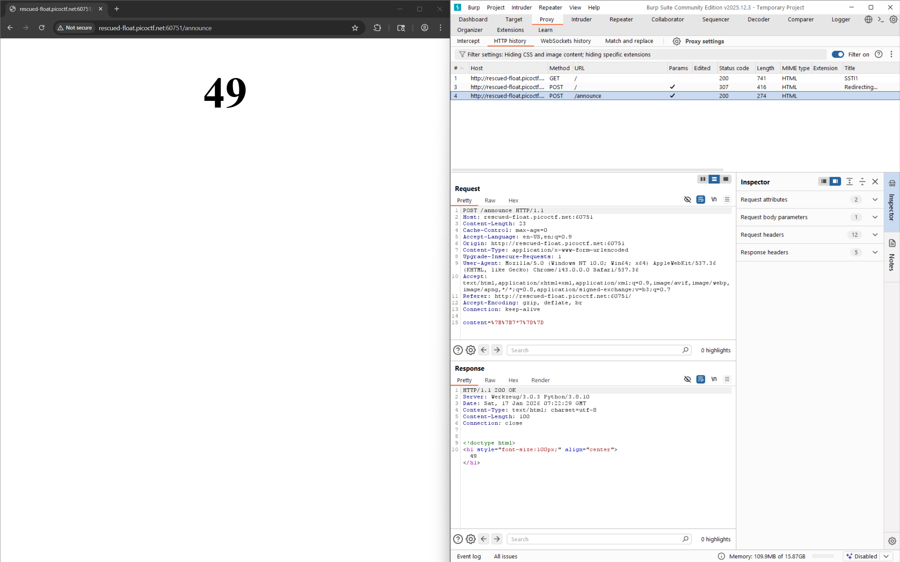

# SSTI1

Hints:
> Server Side Template Injection

Kita diberikan sebuah petunjuk bahwa chall ini mengandung SSTI namun kita tidak tahu apa teknologi yang digunakan.

Kita akan mencobanya...

Setelah di cek ternyata pada chall ini menggunakan teknologi Jinja dari Python. Kita akan coba mengimport terminalnya, agar kita bisa menjalankan perintah `cat` atau sejenisnya untuk membaca flag yang ada pada server tersebut.

Jika kita lihat penulisan class nya agak aneh. Kita cari lebih lanjut...

Woilah gini doang cik...

> Flag: `picoCTF{s4rv3r_s1d3_t3mp14t3_1nj3ct10n5_4r3_c001_9451989d}`