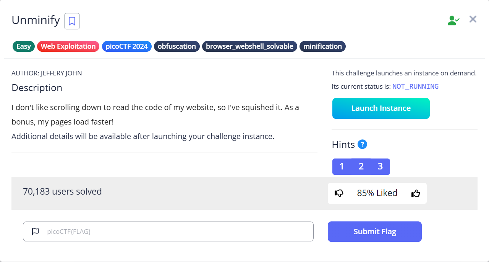
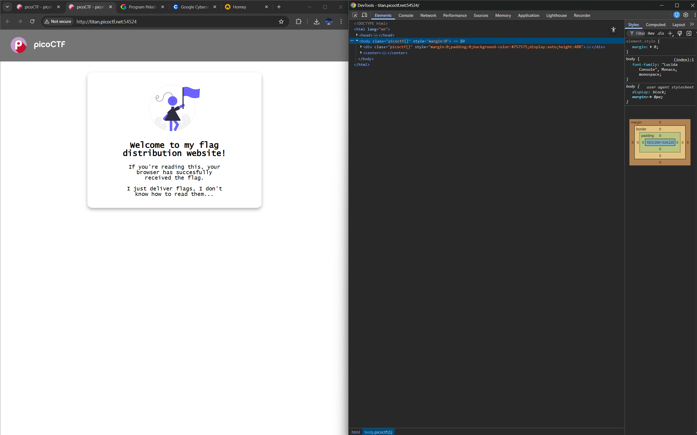
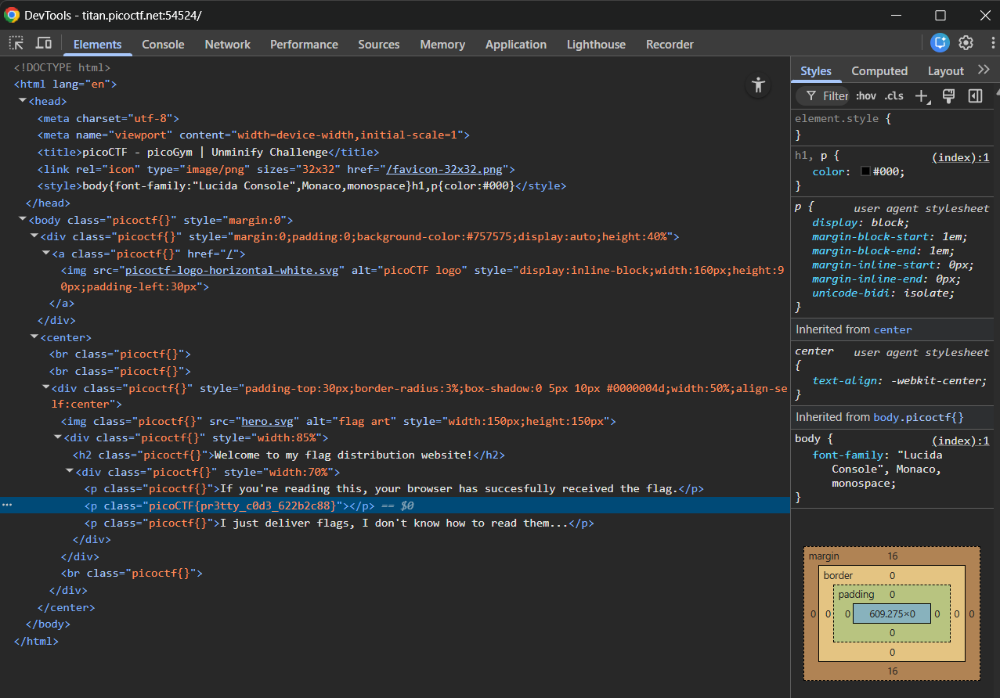

# Unminify

Hints:
> Try CTRL+U / ⌘+U in your browser to view the page source. You can also add 'view-source:' before the URL, or try curl <URL> in your shell.

> Minification reduces the size of code, but does not change its functionality.

> What tools do developers use when working on a website? Many text editors and browsers include formatting.

Pada intinya kita diminta untuk cek source code.

Jika kita lihat penulisan class nya agak aneh. Kita cari lebih lanjut...

Woilah gini doang cik...

> Flag: `picoCTF{pr3tty_c0d3_622b2c88}`