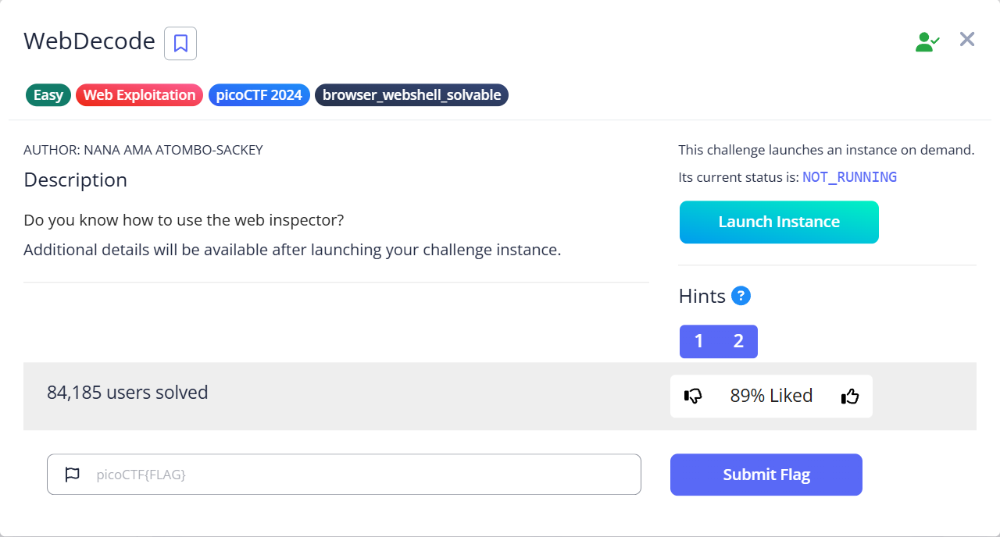
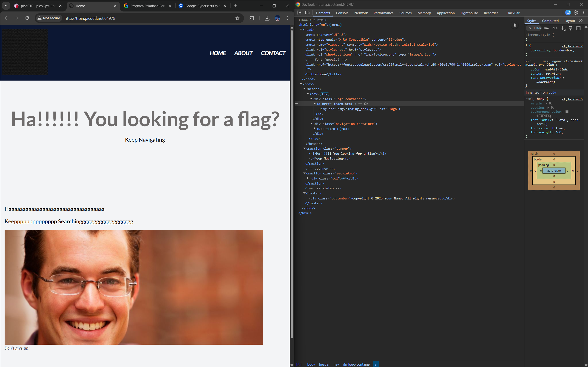
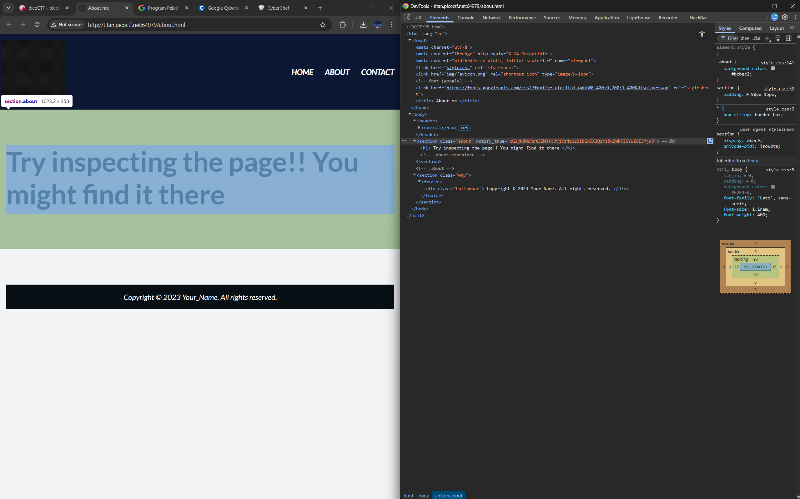
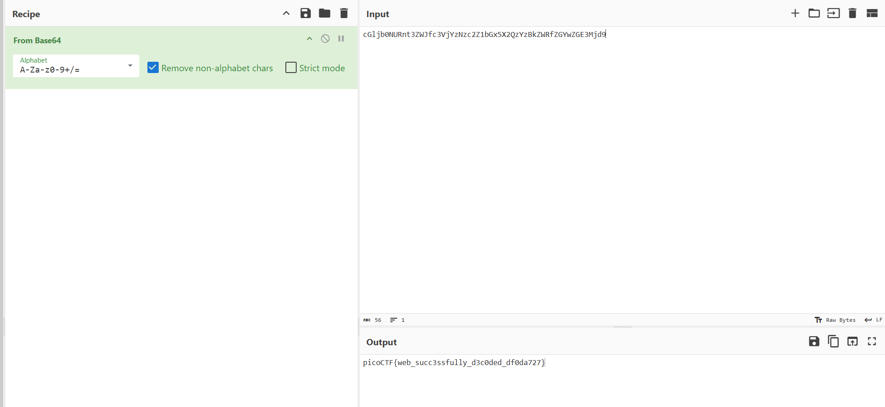

# WebDecode

Hints:
> Use the web inspector on other files included by the web page.

> The flag may or may not be encoded

Pada intinya kita diminta untuk cek source code dan katanya flagnya mungkin gak di enkripsi, hmm...

Di menu home kita tidak melihat kejanggalan, mari petualang ke menu lainnya...

Kita ke menu about dan menemukan sebuah anomali.
Apakah kalian melihat kejanggalan?
Dimana??
Lebih keras!!!
Benar, kejanggalannya ada di notify true...
Mari bawa ke <a href="https://gchq.github.io/CyberChef">CyberChef</a>.

Kita hanya membutuhkan resep Base64 dan woilah dapat...

> Flag: `picoCTF{pr3tty_c0d3_622b2c88}`