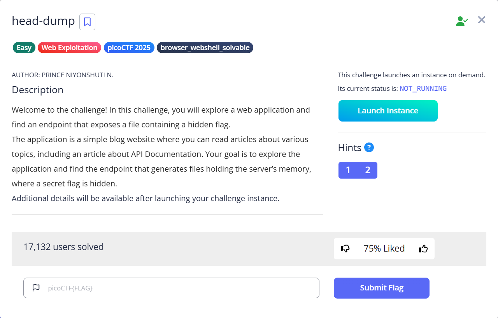
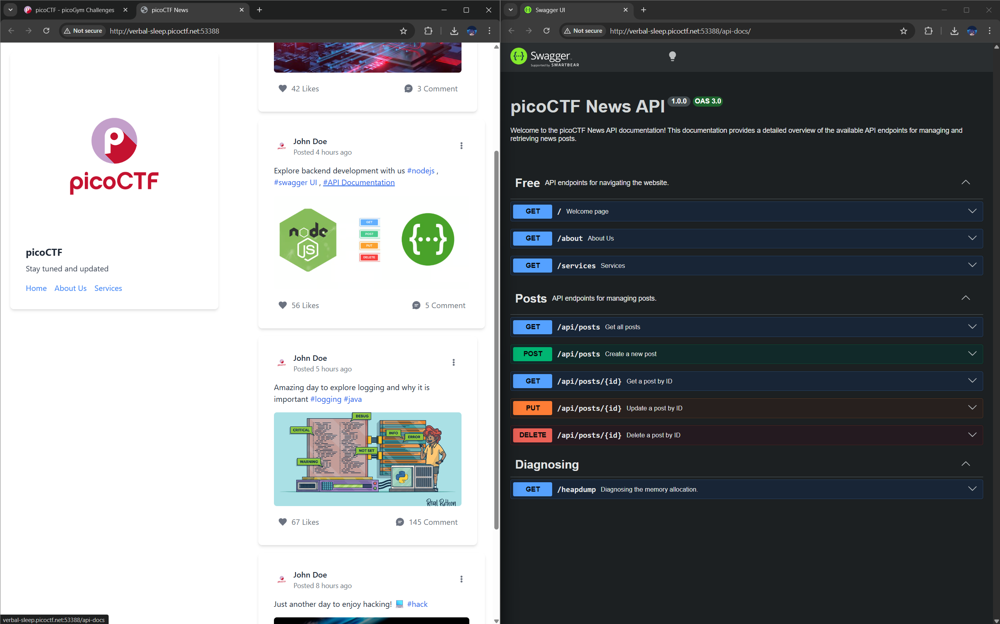
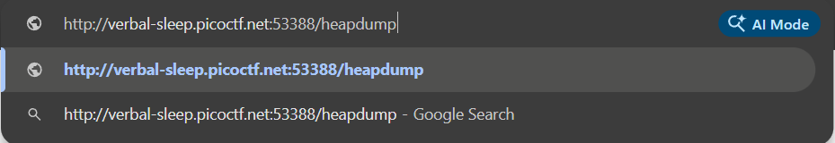
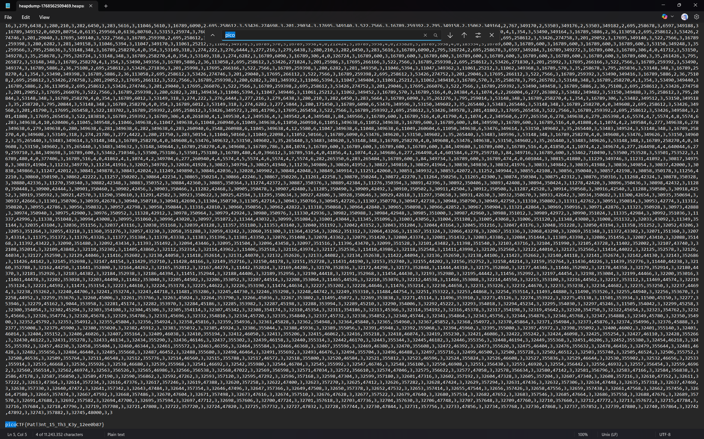

# head-dump

Hints:
> Explore backend development with us

> The head was dumped.

Yang saya tahu pokoknya header yang ada sudah di dump dan ini berhubungan dengan API. Mari kita selidiki.

Disini ternyata terdapat dokumentasi API dan yang paling menarik perhatian yaitu bagian `Diagnosing`. Mari kita coba.

Setelah itu, kita diberikan sebuah file yang bejibun isinya. Namun tidak apa apa ada fitur find.

Hmm ku kira mudah ternyata emang...

Flag: `picoCTF{Pat!3nt_15_Th3_K3y_12ee0b87}`